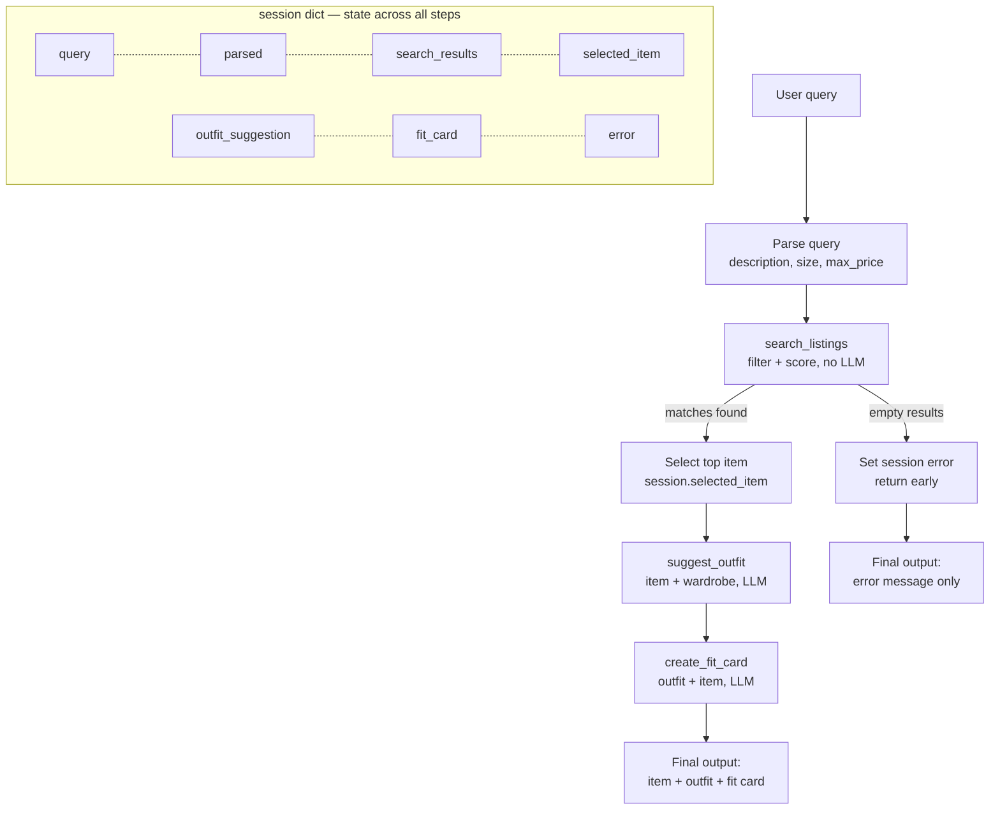
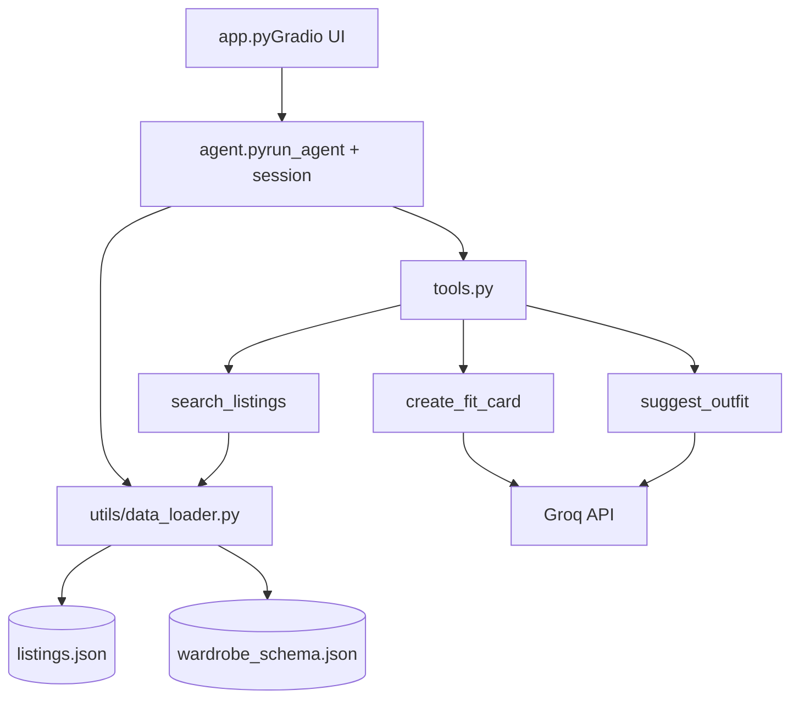

# FitFindr — planning.md

> Complete this document before writing any implementation code.
> Your spec and agent diagram are what you'll use to direct AI tools (Claude, Copilot, etc.) to generate your implementation — the more specific they are, the more useful the generated code will be.
> Your planning.md will be reviewed as part of your submission.
> Update it before starting any stretch features.

---

## Tools

List every tool your agent will use. For each tool, fill in all four fields.
You must have at least 3 tools. The three required tools are listed — add any additional tools below them.

### Tool 1: search_listings

**What it does:**
<!-- Describe what this tool does in 1–2 sentences -->
This is pure Python — it filters the 40 listings based on the search criteria then scores each by keyword overlap against the description. It returns the matches sorted best-first.

**Input parameters:**
<!-- List each parameter, its type, and what it represents -->
- `description` (str): how the user describes what they are looking for
- `size` (str): the size of the outfit - depending on the specific item might be M/L/S or width and length
- `max_price` (float): The maximum price the user is willing to pay

**What it returns:**
<!-- Describe the return value — what fields does a result contain? -->
returns matches sorted best-first

**What happens if it fails or returns nothing:**
<!-- What should the agent do if no listings match? -->
returns empty list 

---

### Tool 2: suggest_outfit

**What it does:**
<!-- Describe what this tool does in 1–2 sentences -->
calls Groq. Takes one listing plus the closet, returns prose describing outfit combinations

**Input parameters:**
<!-- List each parameter, its type, and what it represents -->
- `new_item` (dict): the item chosen from the list which is a best match
- `wardrobe` (dict): user wardrobe which user already owns 

**What it returns:**
<!-- Describe the return value -->
specific outfit combination that pair the new item with named pieces the user already owns

**What happens if it fails or returns nothing:**
<!-- What should the agent do if the wardrobe is empty or no outfit can be suggested? -->
If the wardrobe had been empty, this tool would instead return general styling advice rather than failing.

---

### Tool 3: create_fit_card

**What it does:**
<!-- Describe what this tool does in 1–2 sentences -->
This tool uses the LLM at a higher temperature to write a short, shareable caption that names the item. provides  its price, and the platform once each, capturing the outfit's vibe

**Input parameters:**
<!-- List each parameter, its type, and what it represents -->
- `outfit` (...): outfit_suggestion
- `new_item` (...): selected_item

**What it returns:**
<!-- Describe the return value -->
session["fit_card"]

**What happens if it fails or returns nothing:**
<!-- What should the agent do if the outfit data is incomplete? -->
 see only the error message explaining why nothing matched and what to try next.

---

### Additional Tools (if any)

<!-- Copy the block above for any tools beyond the required three -->

---

## Planning Loop

**How does your agent decide which tool to call next?**
<!-- Describe the logic your planning loop uses. What does it look at? What conditions change its behavior? How does it know when it's done? -->
My agent uses a fixed pipeline with conditional early exits, rather than letting the LLM choose tools freely. The tools have a natural dependency order — you can't suggest an outfit before you've found an item, and you can't write a fit card before you have an outfit — so the order is determined by what each tool needs as input. What makes it a planning loop rather than a hardcoded script is that the agent inspects the result of each step and decides whether to continue, branch, or stop.
---

## State Management

**How does information from one tool get passed to the next?**
<!-- Describe how your agent stores and accesses state within a session. What data is tracked? How is it passed between tool calls? -->
The agent's state lives in a single session dict, which is the only thing the loop looks at to decide what to do next. At each step it reads what's currently in the session and acts on it

---

## Error Handling

For each tool, describe the specific failure mode you're handling and what the agent does in response.

| Tool | Failure mode | Agent response |
|------|-------------|----------------|
| search_listings | No results match the query |set session["error"] to a helpful message suggesting user to try different description |
| suggest_outfit | Wardrobe is empty |agent can either stop with an explanation or fall back to a generic styling message |
| create_fit_card | Outfit input is missing or incomplete | error message explaining why nothing matched and what to try next|

---

## Architecture

<!-- Draw a diagram of your agent showing how the components connect:
     User input → Planning Loop → Tools (search_listings, suggest_outfit, create_fit_card)
                                                                          ↕
                                                                   State / Session
     Show what triggers each tool, how state flows between them, and where error paths branch off.
     ASCII art, a Mermaid diagram (https://mermaid.js.org/syntax/flowchart.html), or an embedded
     sketch are all fine. You'll share this diagram with an AI tool when asking it to implement
     the planning loop and each individual tool. -->

---

## AI Tool Plan

<!-- For each part of the implementation below, describe:
     - Which AI tool you plan to use (Claude, Copilot, ChatGPT, etc.)
     - What you'll give it as input (which sections of this planning.md, your agent diagram)
     - What you expect it to produce
     - How you'll verify the output matches your spec before moving on

     "I'll use AI to help me code" is not a plan.
     "I'll give Claude my Tool 1 spec (inputs, return value, failure mode) and ask it to implement
     search_listings() using load_listings() from the data loader — then test it against 3 queries
     before trusting it" is a plan. -->

**Milestone 3 — Individual tool implementations:**

**Milestone 4 — Planning loop and state management:**

---

## A Complete Interaction (Step by Step)

Write out what a full user interaction looks like from start to finish — tool call by tool call. Use a specific example query.

**Example user query:** "I'm looking for a vintage graphic tee under $30. I mostly wear baggy jeans and chunky sneakers. What's out there and how would I style it?"

**Step 1:**
<!-- What does the agent do first? Which tool is called? With what input? -->
The agent first extracts search parameters from the request. From this query it pulls description="vintage graphic tee", size=None and max_price=30.0. The parsed parameters are stored in session["parsed"]. 

**Step 2:**
<!-- What happens next? What was returned from step 1? What tool is called now? -->
Call search_listings -  search_listings(description="vintage graphic tee", size=None, max_price=30.0). Filters the 40 listings to those at or under $30, then scores each by keyword overlap against the description It returns the matches For this query that surfaces items like the faded grey vintage band tee (lst_033, $19) and the 2003 tour bootleg tee (lst_006, $24). The result list is stored in session["search_results"]

**Step 3:**
<!-- Continue until the full interaction is complete -->
The agent picks the top-scored result as the item to style and stores it in session["selected_item"]. 
Call suggest_outfit.
The agent calls suggest_outfit(new_item=selected_item, wardrobe=wardrobe). This tool uses the LLM. It hands the chosen tee and the user's wardrobe to Groq and asks for specific outfit combinations that pair the new tee with named pieces the user already owns

Call create_fit_card.
The agent calls create_fit_card(outfit=outfit_suggestion, new_item=selected_item). This writes a short, shareable caption that names the item, its price, and the platform once each, capturing the outfit's vibe. The result is stored in session["fit_card"].

**Final output to user:**
<!-- What does the user actually see at the end? -->
The user sees the found item (title, price, platform), the outfit suggestion describing how to wear it with their own clothes, and the shareable fit card caption.
